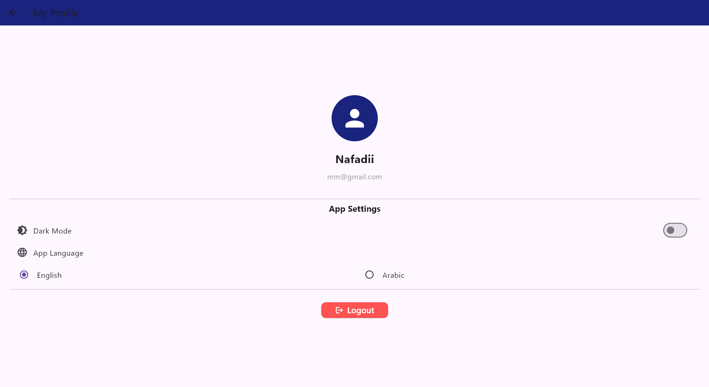

# eLibrary - Digital Library Mobile App

## 📱 About the Project
A comprehensive digital library mobile application designed to provide users with seamless access to a vast collection of PDF books.

## ✨ Key Features
* **Real-time Sync:** Built with Firebase for data synchronization.
* **Smart Search:** Advanced filtering by title, author, or category.
* **Progress Tracking:** Saves the last page read automatically.

## Screenshots

  
  
  
  
  
  

## 🛠️ Tech Stack
* **Frontend:** Flutter & Dart
* **Backend:** PHP & Firebase
* **Database:** MySQL

## 🚀 How to Run
1. `git clone https://github.com/Nafadii/eLibrary-App.git`
2. `flutter pub get`
3. `flutter run`
