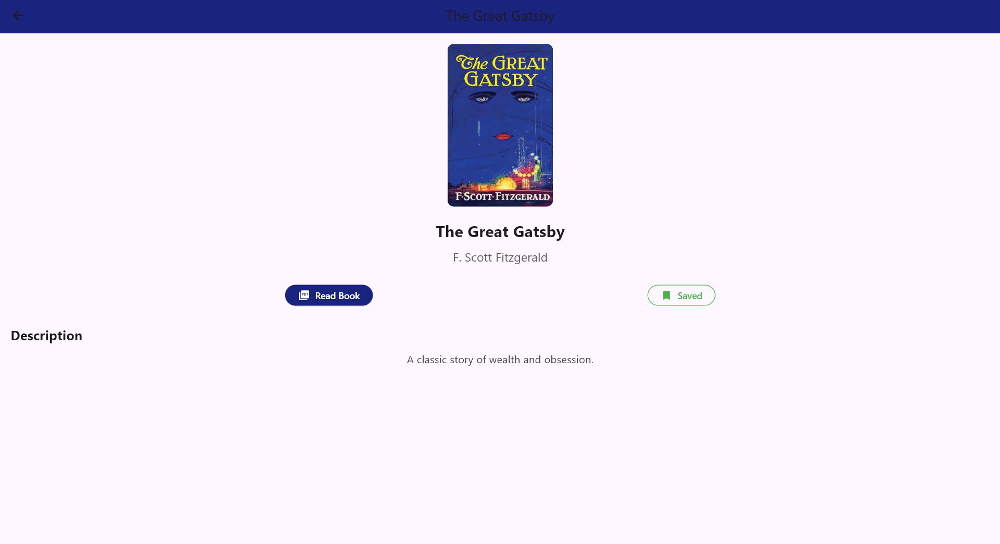

# eLibrary - Digital Library Mobile App

## Description
A comprehensive digital library mobile application designed to provide users with seamless access to a vast collection of PDF books. The app focuses on a smooth reading experience and efficient content management.

## Screenshots

  
  
  
  
  
  

## Tech Stack
* **Frontend:** Flutter, Dart
* **Backend:** PHP, Firebase
* **Database:** MySQL

## Key Features
* **Real-time Synchronization:** Built with Firebase to ensure user data and reading progress are synced across devices.
* **Smart Search & Filtering:** Advanced search functionality to find books by title, author, or category.
* **Progress Tracking:** Automatically saves the last page read for every book.
* **Admin Dashboard:** A PHP-based backend to manage the book catalog and user accounts.

## License
Distributed under the MIT License.
